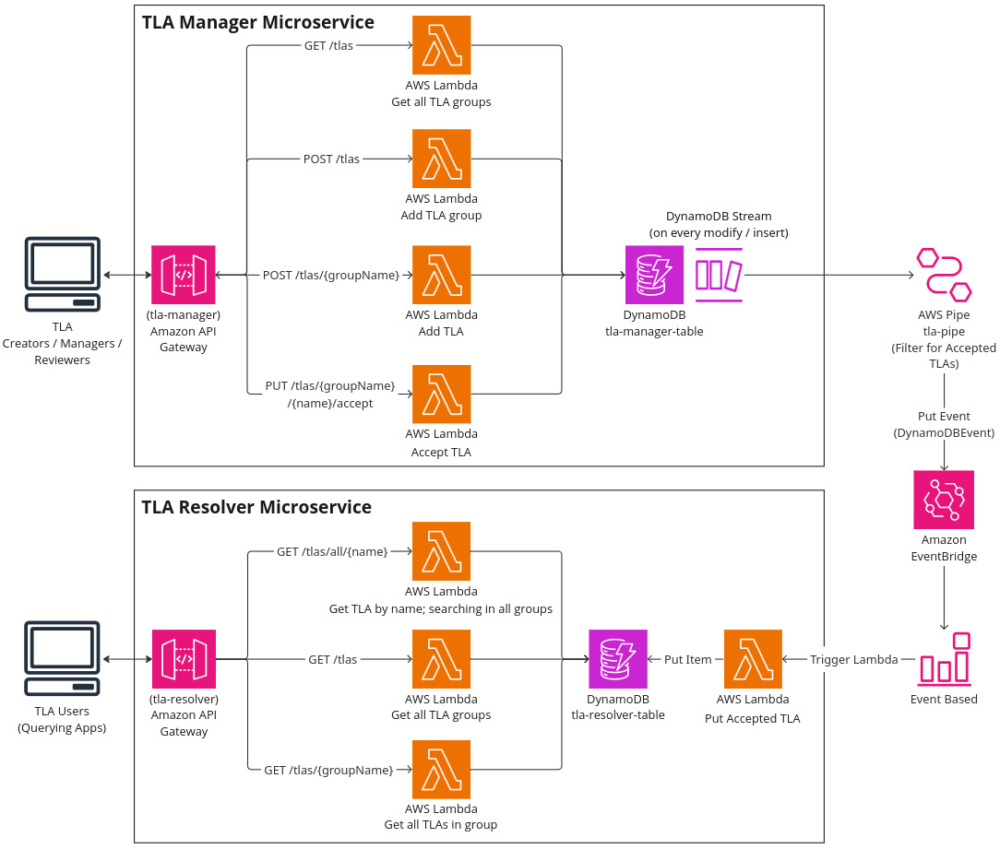

# Three Letter Abbreviations (TLA) Sample Application - Implemented Serverless - Grp04
[](https://github.com/stefan-ka/tla-sample-serverless/actions/workflows/main_build.yml) [](https://opensource.org/licenses/Apache-2.0)

This repository implements the [Three Letter Abbreviations (TLA) Sample Application](https://github.com/ContextMapper/ddd-cm-tla-sample-application) of the [Context Mapper](https://contextmapper.org) project with serverless technology.
The sample application is built with the CQRS ([Command Query Responsibility Segregation](https://martinfowler.com/bliki/CQRS.html)) pattern and is used to manage TLAs (Three Letter Abbreviations) in a distributed system.
It can easily be deployed on AWS by using Serverless SDK. The app illustrates basic CRUD operations using the following AWS services:



 * **Amazon API Gateway** now serves the RESTful HTTP API to access the TLA Manager and Resolver.
 * **AWS Lambda** is used (one function per endpoint) to process the request events of the API gateway, load the data from a DynamoDB table and return a response event back to the gateway. An event based Lambda function can also be used to process the data in the background.
 * **Amazon DynamoDB** is used to persist the proposed and accepted TLAs. The data is stored in a single NoSQL table.
 * **AWS Pipe** is used to check for modifications in the DynamoDB table and trigger and event on the event bus.
 * **Amazon EventBridge** is used to transport the events from the DynamoDB table to the Lambda function. The event bus is used to decouple the components of the application and to allow for asynchronous processing of events. The choreography of the application is based on the [Event-Driven Architecture](https://aws.amazon.com/de/event-driven-architecture/) as described by AWS.

The application is split into two sub-projects and is organized as a monorepo:
* **TLA Manager**: The TLA manager is responsible for managing the TLAs and their groups. It provides the RESTful API to create, read, update and delete TLAs and their groups. The TLA manager is implemented in Java with Spring Boot and Spring Cloud Function. TLAs are in a PROPOSED state until they are accepted. Once accepted, they are in the ACCEPTED state. After the acceptance the DynamoDB Stream is triggered and the event is sent to the EventBridge event bus.
* **TLA Resolver**: The TLA resolver is responsible for providing a public API to the TLAs and their meanings. The resolver only returns TLAs that have been accepted. It uses a separate DynamoDB table to store the accepted TLAs.

Both of these subprojects are deployed together using the [Serverless Framework](https://www.serverless.com/) and can be found in the subfolders `/tla-manager` and `/tla-resolver`.

## Used Technology

The app uses the following tools and frameworks:

 * [Maven](https://maven.apache.org/) to build the app deployable (JAR)
 * [Spring Boot](https://spring.io/projects/spring-boot) and [Spring Cloud Function](https://spring.io/projects/spring-cloud-function) to implement the functions.
 * The [AWS SDK for Java 2.x](https://docs.aws.amazon.com/sdk-for-java/latest/developer-guide/get-started.html) to connect to the DynamoDB.
 * The [Serverless Framework](https://www.serverless.com/) to deploy the whole application on AWS.
   * Including the definition of the API endpoints and the DynamoDB table; see the [serverless.yml](https://github.com/stefan-ka/tla-sample-serverless/blob/main/serverless.yml) file. 
 * [GitHub Actions](https://github.com/stefan-ka/tla-sample-serverless/actions) as CI/CD tool to automatically deploy the app to AWS.
 * [Postman](https://www.postman.com/) to test the API endpoints.
 * [Gitlab CI/CD](https://docs.gitlab.com/ee/ci/) to build the monorepo and deploy the app to AWS.
 * [GNU Make](https://www.gnu.org/software/make/manual/make.html) to build the tla-resolver project and create the executables for the golang lambda functions.
 * [Go](https://golang.org/) to implement the golang lambda functions for the tla-resolver project.

## Build and Deploy the App
The app is built depending on the subproject that should be deployed.
As mentioned above, the app is split into two subprojects: `tla-manager` and `tla-resolver`.

Using the command below in the project root, the entire monorepo can be built together.
```bash
make build
```

The app is built with the [Serverless Framework](https://www.serverless.com/) and can be deployed to AWS.
Serverless contains a feature called [Serverless Compose](https://www.serverless.com/framework/docs/guides/compose/) which allows you to deploy multiple services together.
With the `serverless-compose.yml` file in the root folder, both subprojects can be deployed together.

_Note:_ If the deployment with the composition file fails, you have to deploy the subprojects separately.

_Note:_ It is important to note that the `tla-resolver` project is dependent on the `tla-manager` project, as it uses the EventBridge event bus to receive events from the DynamoDB table of the `tla-manager` project.
The dependency is reflected in the composition file `serverless-compose.yml` in the root folder.

The command below deploys the entire monorepo to AWS. It will build both subprojects and deploy them together.
To display the output of the deployment, the `--debug` flag can be used additionally.

```bash
serverless deploy
```

To remove the entire CloudFormation stacks from AWS, the command below can be used. This will remove all resources that were created during the deployment by Serverless.
```bash
serverless remove
```

_Note:_ The `serverless` command is a shorthand for `sls`, so you can also use `sls deploy` or `sls remove`.

_Note:_ `serverless deploy` only works if you have already set up the serverless framework locally, including logging in and connecting to your AWS account.
See the [Serverless Framework documentation](https://www.serverless.com/framework/docs/getting-started) for more information on how to do this.

### TLA Manager
Building the app and its JAR file is done with Maven:

```bash
./mvnw clean package
```

The command above creates a JAR file `target\tla-sample-serverless-1.2-SNAPSHOT-aws.jar` which contains all the functions (lambdas) of the app.

#### Performance considerations
For the Lambda functions written in Java it is recommended to make use of the `snapStart` option to speed up the cold start time of the functions.
Additionally the GraalVM native image could be used to create a native image of the Java application which is much smaller and faster than the JAR file.
This is currently not implemented in the project. A good starting point for this are the following links:
* [Improving startup performance with Lambda SnapStart](https://docs.aws.amazon.com/lambda/latest/dg/snapstart.html)
* [Quarkus Example](https://github.com/aws-samples/serverless-java-frameworks-samples/tree/main/quarkus)
* [GraalVM](https://www.graalvm.org/latest/reference-manual/native-image/)

#### Test Data
Once `serverless deploy` was successful, you can fill the DynamoDB table with some sample data by executing the `seed_database` function.
You can do this via the following command:

```bash
sls invoke --function seed_database --data 'unused'
```

### TLA Resolver
The TLA resolver is implemented in Golang and uses the AWS SDK for Go to connect to the DynamoDB table.
The app is built with the `Makefile` in the `tla-resolver` folder. The command below builds the app and creates the executables for the golang lambda functions.

```bash
make build
```

The command above creates the executables in single binary format for the lambda functions in the `tla-resolver/cmd` folder.
AWS requires the executeables to be in a single binary format with the name `bootstrap`, so the `Makefile` uses the `GOOS=linux` and `GOARCH=amd64` flags to create the executables for the lambda functions.
A more detailed description of creating the executables can be found in the AWS documentation [here](https://aws.amazon.com/de/blogs/compute/migrating-aws-lambda-functions-from-the-go1-x-runtime-to-the-custom-runtime-on-amazon-linux-2/).
The executables are then zipped and uploaded to AWS Lambda ([Deploy Go Lambda functions with .zip file archives](https://docs.aws.amazon.com/lambda/latest/dg/golang-package.html)).

```bash
make deploy
```
Running the command above builds and deploys the project according to the `serverless.yml` file in the `tla-resolver` folder to AWS.

## Using the API
After the deployment is finished, the API Gateway URL is displayed in the console.
Now you can access the TLA's via the apps API: 🎉


## Use Cases and Endpoints
The application currently supports the following use cases, for which we provide some sample CURLs. 
There is also a [Postman](https://www.postman.com/) collection in the `docs` folder.

_Disclaimer:_ Please note that we haven't implemented any identity and access control measures for this sample application. 
All endpoints are publicly available; including the writing ones (commands). 

_Note_ that you will need to replace `{baseUrl}` with the URLs you get from `sls deploy` in all the following examples.
The base URL is different for each subproject, as the API Gateway is created for each subproject separately, so make sure to use the correct one.

### TLA Manager Endpoints
The TLA manager endpoints are deployed on AWS with the base URL `https://nlygqcukx6.execute-api.us-east-1.amazonaws.com`.

| Endpoint                        | Method | Description                                                                                                                                                                                   |
|---------------------------------|--------|-----------------------------------------------------------------------------------------------------------------------------------------------------------------------------------------------|
| /tlas?status=PROPOSED           | GET    | Get TLAs in PROPOSED state.                                                                                                                                                                   |
| /tlas                           | POST   | Create a new TLA group (see sample payload below). Containing TLAs will be in PROPOSED state.                                                                                                 |
| /tlas/{groupName}               | POST   | Create a new TLA within an existing group (see sample payload below). The created TLA will be in PROPOSED state.                                                                              |
| /tlas/{groupName}/{name}/accept | PUT    | Accept a proposed TLA ([state transition operation](https://microservice-api-patterns.org/patterns/responsibility/operationResponsibilities/StateTransitionOperation): PROPOSED -> ACCEPTED). |

### TLA Resolver Endpoints
The TLA resolver endpoints are deployed on AWS with the base URL `https://5rlkq2ywg0.execute-api.us-east-1.amazonaws.com`.

| Endpoint                        | Method | Description                                                                                                                                                                                   |
|---------------------------------|--------|-----------------------------------------------------------------------------------------------------------------------------------------------------------------------------------------------|
| /tlas                           | GET    | Get all TLA groups including their TLAs (accepted TLAs only).                                                                                                                                 |
| /tlas/{groupName}               | GET    | Get all TLAs of a specific group.                                                                                                                                                             |
| /tlas/all/{name}                | GET    | Search for a TLA over all groups. This query can return multiple TLAs as a single TLA is only unique within one group.                                                                        |

### Get All TLA Groups
The `/tlas` (GET) endpoint returns all TLAs of all TLA groups that are in the `ACCEPTED` state (read on to see how to propose and accept new TLAs). 
Note that all TLAs are part of a group.

**CURL**: `curl -X GET {baseUrl}/tlas`

**Sample output:**

```json
[
    {
        "name":"common",
        "description":"Common TLA group",
        "tlas":[
            {
                "name":"TLA",
                "meaning":"Three Letter Abbreviation",
                "alternativeMeanings":[
                    "Three Letter Acronym"
                ]
            }
        ]
    },
    {
        "name":"AppArch",
        "description":"Application Architecture",
        "tlas":[
            {
                "name":"ADR",
                "meaning":"Architectural Decision Record",
                "alternativeMeanings":[
                ],
                "link":"https://adr.github.io/"
            }
        ]
    },
    {
        "name":"DDD",
        "description":"Domain-Driven Design",
        "tlas":[
            {
                "name":"ACL",
                "meaning":"Anticorruption Layer",
                "alternativeMeanings":[
                ]
            },
            {
                "name":"CF",
                "meaning":"Conformist",
                "alternativeMeanings":[
                ]
            },
            {
                "name":"OHS",
                "meaning":"Open Host Service",
                "alternativeMeanings":[
                ]
            },
            {
                "name":"PL",
                "meaning":"Published Language",
                "alternativeMeanings":[
                ]
            },
            {
                "name":"SK",
                "meaning":"Shared Kernel",
                "alternativeMeanings":[
                ]
            }
        ]
    }
]
```

Note that the endpoint returns all TLAs in state `ACCEPTED` by default. Use the query parameter `status` with the value `PROPOSED` to list TLAs in the `PROPOSED` state (see example below under "Query Proposed TLAs").

### Get TLAs of a Specific Group
The endpoint `/tlas/{groupName}` (GET) returns all TLAs of a specific group.

**Sample CURL**: `curl -X GET {baseUrl}/tlas/DDD`

**Sample output:**

```json
{
    "name": "DDD",
    "description": "Domain-Driven Design",
    "tlas": [
        {
            "name": "ACL",
            "meaning": "Anticorruption Layer",
            "alternativeMeanings": []
        },
        {
            "name": "CF",
            "meaning": "Conformist",
            "alternativeMeanings": []
        },
        {
            "name": "OHS",
            "meaning": "Open Host Service",
            "alternativeMeanings": []
        },
        {
            "name": "PL",
            "meaning": "Published Language",
            "alternativeMeanings": []
        },
        {
            "name": "SK",
            "meaning": "Shared Kernel",
            "alternativeMeanings": []
        }
    ]
}
```

### Search TLA in All Groups
With the endpoint `/tlas/all/{name}` (GET) you can search for a TLA through all groups. Note that this might return multiple results, as TLAs are only unique within one group.

**Sample CURL**: `curl -X GET {baseUrl}/tlas/all/ACL`

**Sample output:**

```json
[
    {
        "name": "DDD",
        "description": "Domain-Driven Design",
        "tlas": [
            {
                "name": "ACL",
                "meaning": "Anticorruption Layer",
                "alternativeMeanings": []
            }
        ]
    }
]
```

### Create new TLA Group
Via `/tlas` (POST) you can create a new TLA group.

**Sample CURL 1 (without containing TLA)**:
```bash
curl --header "Content-Type: application/json" \
  -X POST \
  -d '{ "name": "FIN", "description": "Finance TLAs", "tlas": [] }' \
  {baseUrl}/tlas
```

**Sample CURL 2 (with containing TLA)**: 
```bash
curl --header "Content-Type: application/json" \
  -X POST \
  -d '{ "name": "FIN", "description": "Finance TLAs", "tlas": [ { "name": "ROI", "meaning": "Return on Investment", "alternativeMeanings": [] } ] }' \
  {baseUrl}/tlas
```

**Sample output:** (created group is returned)

```json
{
    "name": "FIN",
    "description": "Finance TLAs",
    "tlas": [
        {
            "name": "ROI",
            "meaning": "Return on Investment",
            "alternativeMeanings": []
        }
    ]
}
```

Note that the new TLA is now in state `PROPOSED` and not delivered by the endpoints mentioned above. They only return TLAs in state `ACCEPTED` by default. Use the following endpoint ("Accept a Proposed TLA") to accept a proposed TLA.

### Add New TLA to Existing Group
With the endpoint `/tlas/{groupName}` (POST) you can add a new TLA to an existing group.

**Sample CURL**:
```bash
curl --header "Content-Type: application/json" \
  -X POST \
  -d '{ "name": "ETF", "meaning": "Exchange-Traded Fund", "alternativeMeanings": [] }' \
  {baseUrl}/tlas/FIN
```

**Sample output:** (updated group is returned)

```json
{
    "name": "FIN",
    "description": "Finance TLAs",
    "tlas": [
        {
            "name": "ETF",
            "meaning": "Exchange-Traded Fund",
            "alternativeMeanings": []
        },
        {
            "name": "ROI",
            "meaning": "Return on Investment",
            "alternativeMeanings": []
        }
    ]
}
```

Note that the new TLA is now in state `PROPOSED` and not delivered by the endpoints mentioned above. They only return TLAs in state `ACCEPTED` by default. Use the following endpoint ("Accept a Proposed TLA") to accept a proposed TLA.

### Query Proposed TLAs
The endpoint `/tlas` (GET) offers a query parameter to list all TLAs in the `PROPOSED` state: `/tlas?status=PROPOSED`

**Sample CURL**: `curl -X GET {baseUrl}/tlas?status=PROPOSED`

**Sample output:**

```json
[
    {
        "name": "FIN",
        "description": "Finance TLAs",
        "tlas": [
            {
                "name": "ETF",
                "meaning": "Exchange-Traded Fund",
                "alternativeMeanings": []
            },
            {
                "name": "ROI",
                "meaning": "Return on Investment",
                "alternativeMeanings": []
            }
        ]
    }
]
```

### Accept a Proposed TLA
With the endpoint `/tlas/{groupName}/{name}/accept` (PUT) you can accept a TLA ("name") within a group ("groupName"). This is a so-called [state transition operation](https://microservice-api-patterns.org/patterns/responsibility/operationResponsibilities/StateTransitionOperation).
**Sample CURL**: `curl -X PUT {baseUrl}/tlas/FIN/ROI/accept` (puts the TLA 'ROI' in group 'FIN' into state `ACCEPTED`)
This endpoint does not expect a body (JSON) and does also not return one. The command is successful if HTTP state 200 is returned.
Once the TLA is accepted, the query endpoints listed above (such as `/tlas` or `/tlas/{groupName}`) will now list them.

## Contributing
Contributions are always welcome! Here are some ways how you can contribute:
* Create GitHub issues if you find bugs or just want to give suggestions for improvements.
* This is an open source project: if you want to code,
  [create pull requests](https://help.github.com/articles/creating-a-pull-request/) from
  [forks of this repository](https://help.github.com/articles/fork-a-repo/). Please refer to a GitHub issue if you
  contribute this way.

## Licence
This project is released under the [Apache License, Version 2.0](http://www.apache.org/licenses/LICENSE-2.0).

## References and additional resources
* [Create and deploy AWS Step Function with Serverless framework](https://blog.searce.com/create-and-deploy-aws-step-function-with-serverless-framework-e6e9844359e5)
* [AWS Golang Rest API with DynamoDB](https://www.serverless.com/examples/aws-golang-rest-api-with-dynamodb)
* [CQRS - Command Query Responsibility Segregation](https://martinfowler.com/bliki/CQRS.html)
* [Migrating AWS Lambda functions from the Go1.x runtime to the custom runtime on Amazon Linux 2](https://aws.amazon.com/de/blogs/compute/migrating-aws-lambda-functions-from-the-go1-x-runtime-to-the-custom-runtime-on-amazon-linux-2/)
* [Event-based apps with Go and EventBridge](https://wahlstrand.dev/posts/2022-06-26-event-based-system-on-aws/)
* [Deploy Go Lambda functions with .zip file archives](https://docs.aws.amazon.com/lambda/latest/dg/golang-package.html)
* [EventBridge to Lambda](https://serverlessland.com/patterns/eventbridge-lambda-sls)